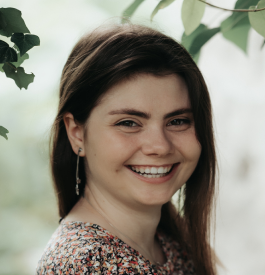

# CV-1 

## Olga Ribakova 



-----------------------------  

1. ### Contacts: 

    * __Phone:__ *+995599972990*
	* __LinkedIn:__ *[LinkedIn](https://www.linkedin.com/in/olga-ribakova-94a825179/)*
	* __GitHub:__ *[OliaRyb](https://github.com/OliaRyb)*
	* __Email:__ _olya.rybakova.3004@gmail.com_
	* __Discord:__ _Olia (github - @OliaRyb)_

-----------------------------

2. ### About myself:  

Responsible and detail-oriented manual QA specialist with an analytical mindset. Skilled in identifying and documenting defects, ensuring high-quality software. Experienced in creating check lists and executing tests. Committed to continuous
development and improving testing processes to achieve the best results.

-----------------------------

3. ### Skills: 

    * Testing Theory
	* Test documentation creation (Test Cases, Check-lists, Bug report, Test Result Report)
	* Test Design Techniques
	* Terminal (CLI)
	* GIT
	* HTML/CSS
	* SQL
	
-----------------------------

4. ### Code: 

```
function multiply(a, b){
  return a * b
}
```

-----------------------------

5. ### Experience: 

    * __QA Software Engineer__
        + __ITX__
	    + _02/2024- Present Time_
    * __QA Software Engineer (Trainee)__
        + __ITX__
		+ _07/2023-09/2024_
    * __Math Tutor__
	    + __Self-employed__
		+ _01/2015-06/2023_
    * __Data Analyst on the Workfusion Projects__
	    + __IBA group__
		+ _03/2018-03/2019_
		
-----------------------------

6. ### Education: 

    * __Mathematician, IT Specialist. Bachelor’s Degree__
		+ _Belarusian State University, Faculty of Mechanics and Mathematics_
		+ _01/2013-06/2018_
	* __EPAM Software Testing Program__
		+ _Training center EPAM_
		+ _06/2023-09/2023_
	* __Software Testing Course by Vadim Ksendzov__
	    + _06/2023-11/2023_
		
-----------------------------

7. ### Languages: 

    * English: (B1+)
	* Russian: (Native)
	* Belarussian: (Native)
